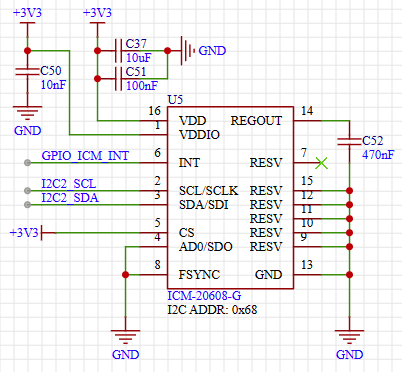
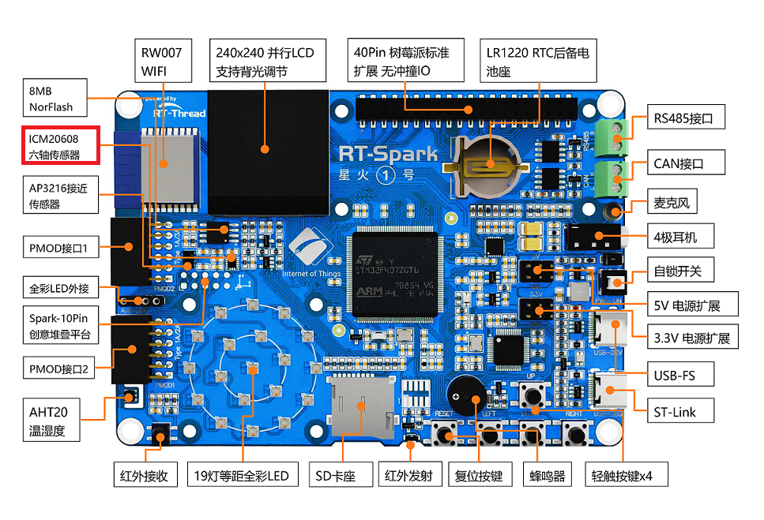

# ICM20608 六轴传感器例程

## 简介

本例程主要功能是利用 RT-Thread 的 ICM20608 软件包读取传感器 icm20608 所测量的三轴加速度（three accelerate）、三轴陀螺仪（three gyroscope）。

## ICM20608 软件包简介

ICM20608 软件包是 RT-Thread 针对六轴传感器 icm20608 功能使用的实现，使用这个软件包，可以让该传感器在 RT-Thread 上非常方便使用 icm20608 的基本功能，包括读取三轴加速度（3-axisaccelerometer）、三轴陀螺仪（3-axis gyroscope）、零值校准等功能，如需详细了解该软件包，请参考 ICM20608 软件包中的 README。

## 硬件说明

icm20608 硬件原理图如下所示：




如上图所示，单片机通过 I2C2(soft) scl(PF1)、 I2C2(soft) sda(PF0) 对传感器 icm20608 发送命令、读取数据等， ICM_INT(PG12) 为硬件中断引脚。

六轴传感器在开发板中的位置如下图所示：



该传感器能够实现如下功能：

- 支持4种三轴加速度量程
- 支持4种三轴陀螺仪量程
- 支持零值校准

## 软件说明

本例程的源码位于 `/projects/03_driver_axis`。

六轴传感器 icm20608 的示例代码位于 applications/main.c 中，主要流程：初始化传感器 -> 零值校准 -> 读取三轴加速度与三轴陀螺仪，分别展开如下所述：

1. 初始化传感器

初始化函数 icm20608_init 传入的参数 i2c_bus_name 为该传感器挂载的 i2c 总线名称，进行初始化；    初始化若失败，则返回空，若成功，则返回六轴传感器的设备对象 dev。

2. 零值校准

首先在进行零值校准时， x 轴、 y 轴应处于水平状态，且传感器处于静态；其次使用零值校准函数 icm20608_calib_level 进行零值校准时，传入设备对象 dev 与读取零值次数（此处为 10 次，可以改动），若失败，释放资源，提示失败，释放资源，若成功，返回 RT_EOK，零值数据存放在设备对象 dev 中，详细零值存放参考 icm20608 软件包 中零值校准章节。

3. 读取三轴加速度与三轴陀螺仪

成功校准后，进行数据读取。如果失败，提示传感器不正常工作；如果成功，打印读取的三轴加速度与三轴陀螺仪的测量值（详细的 API 介绍参考 icm20608 软件包读取三轴加速度与三轴陀螺仪章节，源码参考 icm20608.c）。

示例代码如下：

```c
int main(void)
{
    icm20608_device_t dev = RT_NULL;
    const char *i2c_bus_name = "i2c2";
    int count = 0;
    rt_err_t result;

    /* 初始化 icm20608 传感器 */
    dev = icm20608_init(i2c_bus_name);
    if (dev == RT_NULL)
    {
        LOG_E("The sensor initializes failure");

        return 0;
    }
    else
    {
        LOG_D("The sensor initializes success");
    }

    /* 对 icm20608 进行零值校准：采样 10 次，求取平均值作为零值 */
    result = icm20608_calib_level(dev, 10);
    if (result == RT_EOK)
    {
        LOG_D("The sensor calibrates success");
        LOG_D("accel_offset: X%6d  Y%6d  Z%6d", dev->accel_offset.x, dev->accel_offset.y, dev->accel_offset.z);
        LOG_D("gyro_offset : X%6d  Y%6d  Z%6d", dev->gyro_offset.x, dev->gyro_offset.y, dev->gyro_offset.z);
    }
    else
    {
        LOG_E("The sensor calibrates failure");
        icm20608_deinit(dev);

        return 0;
    }

    while (count++ < 100)
    {
        rt_int16_t accel_x, accel_y, accel_z;
        rt_int16_t gyros_x, gyros_y, gyros_z;

        /* 读取三轴加速度 */
        result = icm20608_get_accel(dev, &accel_x, &accel_y, &accel_z);
        if (result == RT_EOK)
        {
            LOG_D("current accelerometer: accel_x%6d, accel_y%6d, accel_z%6d", accel_x, accel_y, accel_z);
        }
        else
        {
            LOG_E("The sensor does not work");
            break;
        }

        /* 读取三轴陀螺仪 */
        result = icm20608_get_gyro(dev, &gyros_x, &gyros_y, &gyros_z);
        if (result == RT_EOK)
        {
            LOG_D("current gyroscope    : gyros_x%6d, gyros_y%6d, gyros_z%6d", gyros_x, gyros_y, gyros_z);
        }
        else
        {
            LOG_E("The sensor does not work");
            break;
        }
        rt_thread_mdelay(1000);
    }

    return 0;
}
```
### 编译 & 下载

- RT-Thread Studio：在 RT-Thread Studio 的包管理器中下载 `STM32F407-RT-SPARK` 资源包，然后创建新工程，执行编译。
- MDK：首先双击 mklinks.bat，生成 rt-thread 与 libraries 文件夹链接；再使用 Env 生成 MDK5 工程；最后双击 project.uvprojx 打开 MDK5 工程，执行编译。

编译完成后，将开发板的 ST-Link USB 口与 PC 机连接，然后将固件下载至开发板。

### 运行效果

烧录完成后，此时可以在 PC 端使用终端工具打开开发板的 ST-Link 提供的虚拟串口，设置串口波特率为 115200，数据位 8 位，停止位 1 位，无流控，开发板的运行日志信息即可实时输出出来，显示如下所示：

```shell
[D/main] The sensor initializes success
[D/main] The sensor calibrates success
[D/main] accel_offset: X   718  Y  1524  Z  1199
[D/main] gyro_offset : X   -89  Y    71  Z   -54
[D/main] current accelerometer: accel_x   122, accel_y   -68, accel_z 16441
[D/main] current gyroscope    : gyros_x    45, gyros_y    -9, gyros_z   -19
[D/main] current accelerometer: accel_x    94, accel_y   -36, accel_z 16561
[D/main] current gyroscope    : gyros_x    10, gyros_y   -15, gyros_z    -7
[D/main] current accelerometer: accel_x   -18, accel_y   -40, accel_z 16421
[D/main] current gyroscope    : gyros_x     5, gyros_y    -3, gyros_z    13
[D/main] current accelerometer: accel_x    42, accel_y     4, accel_z 16549
[D/main] current gyroscope    : gyros_x    10, gyros_y    -6, gyros_z    -5
[D/main] current accelerometer: accel_x    14, accel_y    32, accel_z 16489
[D/main] current gyroscope    : gyros_x    13, gyros_y    -4, gyros_z    -5
[D/main] current accelerometer: accel_x    38, accel_y    40, accel_z 16381
[D/main] current gyroscope    : gyros_x    12, gyros_y    11, gyros_z    13
[D/main] current accelerometer: accel_x    70, accel_y   -20, accel_z 16369
[D/main] current gyroscope    : gyros_x    -5, gyros_y     9, gyros_z     0
[D/main] current accelerometer: accel_x    30, accel_y   -52, accel_z 16457
[D/main] current gyroscope    : gyros_x    11, gyros_y     5, gyros_z    -3
[D/main] current accelerometer: accel_x   -94, accel_y   -24, accel_z 16473
[D/main] current gyroscope    : gyros_x    42, gyros_y     0, gyros_z    13
[D/main] current accelerometer: accel_x   -38, accel_y   -64, accel_z 16421
[D/main] current gyroscope    : gyros_x    27, gyros_y    -7, gyros_z    -3
[D/main] current accelerometer: accel_x    78, accel_y    52, accel_z 16513
[D/main] current gyroscope    : gyros_x    11, gyros_y    16, gyros_z   -23
[D/main] current accelerometer: accel_x    26, accel_y   -16, accel_z 16409
[D/main] current gyroscope    : gyros_x     5, gyros_y    -8, gyros_z    -2
```

## 注意事项

暂无。

## 引用参考

- 设备与驱动：[PIN 设备](https://www.rt-thread.org/document/site/#/rt-thread-version/rt-thread-standard/programming-manual/device/pin/pin)
- icm20608 软件包：[https://github.com/RT-Thread-packages/icm20608](https://github.com/RT-Thread-packages/icm20608)

