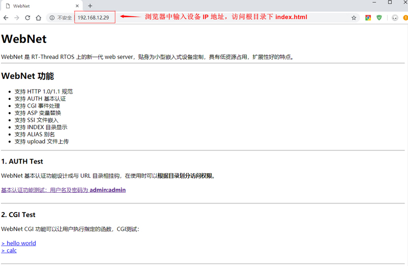
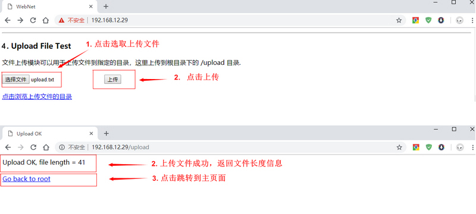
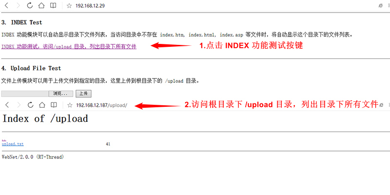
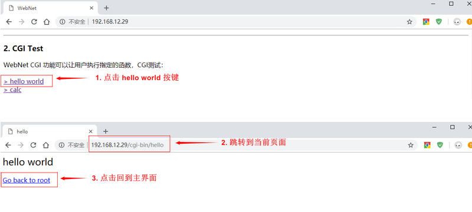
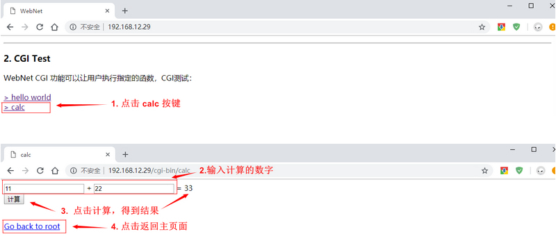

# 使用 Web 服务器组件：WebNet

## 简介

本例程使用 WebNet 软件包创建一个 Web 服务器，并展示 Web 服务器静态页面、CGI（事件处理）、AUTH（基本认证）、Upload（文件上传） 等部分功能。

## 硬件说明

本例程需要依赖星火 1 号板卡上的 WiFi 模块和 TF 卡模块，因此请确保硬件平台上的 WiFi 模块和 TF 卡模块可以正常工作。

## 准备工作

1. 使能文件系统（可以使用 SD 卡文件系统或者 Flash 文件系统）
2. 在 TF 卡根目录下创建 webnet 文件夹。(本示例在 Rt-Thread Settings 中已经开启了 SD 卡文件系统，并且使能了自动挂载。所以路径为 /sdcard/webnet , 并且已经在 Rt-Thread Settings 中配置了 webnet 根目录为 "/sdcard/webnet")
3. 在 webnet 文件夹里创建 admin 和 upload 两个文件夹。
4. 将 `/projects/05_iot_web_server/packages/webnet-v2.0.3/samples/` 目录下 index.html、index.shtml、version.asp 复制到 TF 卡的 webnet 文件夹里。

    * 方案 A 可以使用 netutils 软件包中的 tftp 工具配合 pc 端 tftpd 软件。
    * 方案 B 可以使用读卡器直接将文件复制进 SD 卡对应目录。

完成之后的目录结构如图所示:

```shell
msh /sdcard/webnet>ls
Directory /sdcard/webnet:
index.html          2737
index.shtml         322
version.asp         205
admin               <DIR>
upload              <DIR>
```

index.html 文件是访问 web 服务器时默认展示的页面，我们提供的 html 文件是用来测试本例程的相关功能的。熟悉 HTML 语言的开发者可以自己编写 index.html 页面，并放入 webnet 文件夹里。

## 软件说明

**WebNet** 例程位于 `/projects/05_iot_web_server` 目录下，重要文件摘要说明如下表所示：

| 文件                           | 说明            |
| :----------------------------- | :-------------- |
| applications/main.c            | app 入口        |
| packages/webnet-v2.0.3         | 示例网页        |

本例程主要展示了 WebNet 的几个常用功能，程序代码位于 `/projects/05_iot_web_server/packages/webnet-v2.0.3/samples/wn_sample.c` 文件中。

```c
void webnet_test(void)
{
    webnet_cgi_register("hello", cgi_hello_handler);
    webnet_cgi_register("calc", cgi_calc_handler);
    webnet_asp_add_var("version", asp_var_version);
    webnet_alias_set("/test", "/admin");
    webnet_auth_set("/admin", "admin:admin");
    extern const struct webnet_module_upload_entry upload_entry_upload;
    webnet_upload_add(&upload_entry_upload);

    webnet_init();
}
```

## 运行

### 编译 & 下载

- RT-Thread Studio：在 RT-Thread Studio 的包管理器中下载 `STM32F407-RT-SPARK` 资源包，然后创建新工程，执行编译。
- MDK：首先双击 mklinks.bat，生成 rt-thread 与 libraries 文件夹链接；再使用 Env 生成 MDK5 工程；最后双击 project.uvprojx 打开 MDK5 工程，执行编译。

编译完成后，将开发板的 ST-Link USB 口与 PC 机连接，然后将固件下载至开发板。

### 运行效果

按下复位按键重启开发板，正常运行后，终端输出信息如下：

```shell
msh /sdcard/webnet/upload>
 \ | /
- RT -     Thread Operating System
 / | \     4.1.1 build Jun 28 2023 10:19:44
 2006 - 2022 Copyright by RT-Thread team
lwIP-2.0.3 initialized!
[I/sal.skt] Socket Abstraction Layer initialize success.
msh />[I/SDIO] SD card capacity 1967104 KB.
m[E/[RW007]] The wifi Stage 1 status 0 0 0 1
[I/WLAN.dev] wlan init success
[I/WLAN.lwip] eth device init ok name:w0
[I/WLAN.dev] wlan init success
[I/WLAN.lwip] eth device init ok name:w1

rw007  sn: [rw007c745bb22fc584aa6cf0c]
rw007 ver: [RW007_2.1.0-a7a0d089-57]

[I/app.filesystem] SD card mount to '/sdcard'
```

连接 wifi 并且启动测试程序
```sheel
wifi join demoo 19981111
[I/WLAN.mgnt] wifi connect success ssid:demoo
msh />[I/WLAN.lwip] Got IP address : 192.168.181.31
webnet_test
msh />webnet_test
```

### 静态页面展示

访问 web 服务器根目录时，web 服务器会默认展示根目录下的 **index.html** 或者 **index.htm** 文件。如果没找到文件，就会列出根目录下的所有文件。根目录可以通过修改 Rt-Thread Settings 中的 Server root directory 来修改，默认为 `/sdcard/webnet`。

在浏览器（这里使用谷歌浏览器）中输入刚刚打印的设备 IP 地址，将访问我们之前放入根目录（/sdcard/webnet）的 **index.html** 文件，如下图所示，页面文件正常显示：



该页面上显示了 WebNet 软件包的基本功能介绍，并在下方给出相应的测试示例。

开发者如果想要访问别的页面，可以将要展示的网页放在 TF 卡根目录下任意路径，然后在浏览器里输入服务器的 IP 地址加网页相对于根目录的相对路径，即可访问对应的网页。例如，根目录为 `/sdcard/webnet`，想要访问在 TF 卡里的 `/sdcard/webnet/product/a.html` 网页，在浏览器里输入：开发板的 IP 地址 `/product/a.html`，即可打开 a.html 网页。

### AUTH 基本认证例程

在例程主页（ /index.html）AUTH Test   模块下点击 `基本认证功能测试：用户名及密码为 admin:admin` 按键，弹出基本认证对话框，输入用户名 **admin**，密码 **admin**。成功输入用户名和密码后，会进入根目录下 /admin 目录，如下图所示流程：


### Upload 文件上传例程

Upload 例程实现上传文件到 WebNet 服务器固定目录功能。在例程主页上 Upload File Test 模块下点击 ` 选择文件 ` 按键，选取需要上传的文件（本例程是用 upload.txt 文件），点击 `上传`，可以将文件上传到根目录下的 `/upload` 目录，如下图所示：



### INDEX 目录显示例程

INDEX 例程演示页面文件列表功能。

然后在例程主页 INDEX Test 模块下点击 `INDEX 功能测试：访问 /upload 目录 ` 按键，会跳转到根目录下 `/upload` 目录，并且列出该目录下所有文件名和文件长度，如下图所示：



### CGI 事件处理例程

本例程提供两个 CGI 示例：**hello world 例程** 和 **calc 例程** ，用于演示 CGI 事件处理的基本功能。

- **hello world 例程**

hello world 例程演示了在页面演示文本内容功能，在例程主页 CGI Test  模块下点击 `> hello world` 按键，会跳转到新页面显示日志信息，新页面显示了 hello world 说明 CGI 事件处理成功，然后在新页面点击 `Go back to root` 按键回到例程主页面，如下图所示：



- **calc 例程**

calc 例程中使用 CGI 功能在页面上展示了简单的加法计算器功能，在例程主页 CGI Test  模块下点击 `> calc` 按键，会跳转到新的页面，输入两个数字点击 ` 计算 ` 按键，页面会显示两数字相加的结果。在新页面点击 `Go back to root` 按键可以回到例程主页面，如下图所示：



## 注意事项

- 首次运行例程，需要使用 `wifi join ssid password` 来连接 WIFI。
- 如果初始化文件系统失败，需要使用 `mkfs -t elm sd0` 命令来在 TF 卡上建立一个文件系统，然后重启系统。
- TF 卡里需要有 webnet，webnet/admin 和 webnet/upload 三个文件夹，否则例程访问会出错。
- 想要了解更多的 WebNet 软件包的功能，可以查阅 WEBNET 用户手册。

## 引用参考

- 组件：[文件系统](https://www.rt-thread.org/document/site/#/rt-thread-version/rt-thread-standard/programming-manual/filesystem/filesystem)
- 设备与驱动：[WLAN 设备](https://www.rt-thread.org/document/site/#/rt-thread-version/rt-thread-standard/programming-manual/device/wlan/wlan)
- WebNet 软件包：[https://github.com/RT-Thread-packages/webnet](https://github.com/RT-Thread-packages/webnet)
- 文档中心：[RT-Thread 文档中心](https://www.rt-thread.org/document/site/#/)
